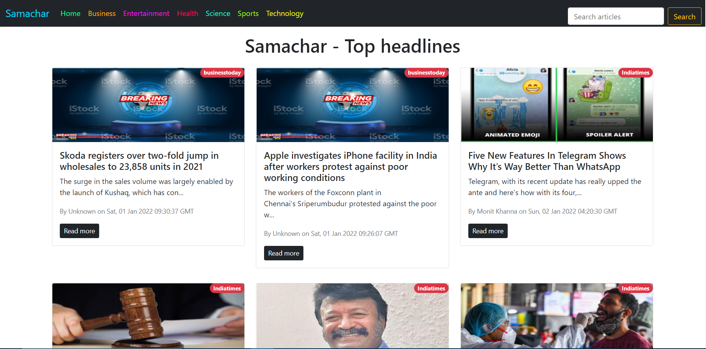

# Samachar | Grab your daily news bites

Samachar is a web application built using ReactJS and newsapi.org API. It is a news application on which a user can read tons of news articles.

## Table Of Contents

- [Overview](#overview)
  - [The Project](#the-project)
  - [Screenshot](#screenshot)
  - [Demo](#demo)
- [Development](#development)
  - [Tech Stack](#tech-stack)
  - [What i learned](#what-i-learned)
  - [Useful Resources](#useful-resources)
- [Author](#author)

## Overview

### The Project

Samachar is a web application built using ReactJs and newsapi.org. A user can read articles on the app with sufficient meta-info about the article. User can choose a certain category to fetch articles the user wants to read. User can also search for particular article he has in mind.

Front End of the project is built using ReactJS. All the components used are funtional based components. The Front End design of the project is fully-responsive.

All the news is fetched from newsapi.org using free API. The project can only be used on localhost erver and will not work if deployed on web due to the restrictions put by newsapi.org for using the API.

### Screenshot



### Demo

This project will not work if deployed on web. To use this project, clone this directory and install all the dependencies using package.json. Create a .env.local file in src directory and mention your newsapi.org APIKEY like this

```
REACT_APP_NEWS_API_KEY = <your-api-key>
```

then run `npm start` command to run the project.

## Development

### Tech Stack

- HTML5 markup
- CSS custom properties
- Bootstrap
- Javascript
- ReactJS Library

### What i learned

I learned a lot of things working on this project. When i started this project i was learning ReactJS and this project helped me to get better at ReactJS.
I learned to work with an external API.

### Useful Resources

There were times when i got stuck on some things while working on this project, for which i took help from a few websites which was very much helpful for me. The websites that helped me the most are:
- [StackOverflow](https://stackoverflow.com) for debugging and
- [YouTube](https://youtube.com) for learning new things.

## Author

- GitHub - [@yash1699](https://github.com/yash1699)
- LinkedIn - [@yash-verma-5a84641a9](https://linkedin.com/in/yash-verma-5a84641a9)